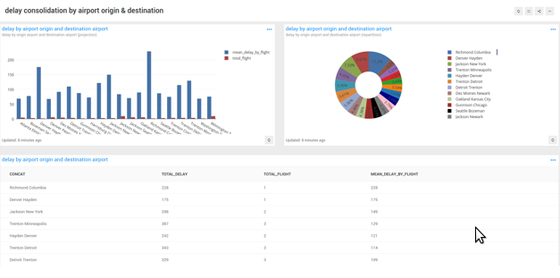

The goal of this lab is to experiment a reporting solution that will
use data on postgresql.

We will use redash.io as reporting solution.



Instructions
============

1. clone this repository

```bash
git clone https://github.com/Esme-Sudria-Database/lab-reporting.git
cd lab-reporting
```

2. clone redash repository

```
git clone  https://github.com/getredash/redash.git
cd redash
```
3. install npm libraries and build web assets

```
npm install
npm run build
```

4. initiate redash internal database

```
docker-compose run --rm server create_db
```

5. run redash

```
docker-compose -f docker-compose.production.yml up
```

6. open a browser on http://localhost:5000

7. run the vm lab-postgresql, use it as datasource on redash with the database `transtats`

Reference
=========

* [Redash - Github](https://github.com/getredash/redash)
* [Docker Based Developer Installation Guide](https://redash.io/help/open-source/dev-guide/docker)
